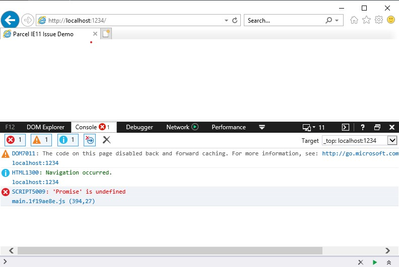
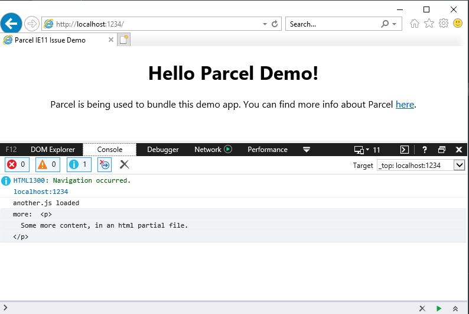

# parcel-plugin-goodie-bag

A polyfill for `Promise` and `fetch` to keep Parcel working for those without it.

[Looking at you Internet Explorer](https://techcommunity.microsoft.com/t5/Windows-IT-Pro-Blog/The-perils-of-using-Internet-Explorer-as-your-default-browser/ba-p/331732).

## Why This Is Needed

TL;DR: multiple bundle support in Parcel, such as using the ability to require html partial files, makes direct use of both the `Promise` and `fetch` APIs, directly.

This plugin is born of my frustaration with the scenario outline in [parcel issue #2364](https://github.com/parcel-bundler/parcel/issues/2364). This requires additional intervention, since the native requirement of the potentially un-polyfilled APIs is prior to any polyfill via `babel-polyfill` and isn't something that can be influenced inside the application source itself; at least not without convoluted efforts.

## Installation

- `npm install --save-dev parcel-plugin-goodie-bag`

## Usage

No additional configuration required. If your app is being bundled by parcel and you have this plugin installed, the processed application will build with:

- the `*.html` containing a `script` tag in its head pointing to the "goodie bag` script (the two polyfills)
- a "goodie bag" script file, placed in the destination directory (`outDir` to parcel, defaults to `dist`)
- the script tag will respect your configured `publicUrl` option with Parcel (e.g.- prefixed with default `/` or no root slash in the case of `.`)

## In Action

I made use of [a simple reproducible repository](https://github.com/edm00se/parcel-ie11-issue-demo) I had set up for tracking this issue.

| Before                         | After                        |
|--------------------------------|------------------------------|
|    |    |

## Contributing

If you have something to contribute, please do. If you're uncertain as to whether or not to open a PR, feel free to ask; just open an issue and mark that it's a question.

## History

Parcel is an amazing bundler with superpowers. The fact that my ability to support IE(11), a requirement for my day job, was hampered by this limitation of a multiple bundle scenario meant that I had to solve the problem myself. It is my hope that one day the configuration of Parcel will allow for the surfacing of base level APIs, such as `Promise` and `fetch` to make this plugin unnecessary. Until then, I'll keep this available to provide some sanity.

## Credits

- [parcel](https://parceljs.org/)

## License

MIT
